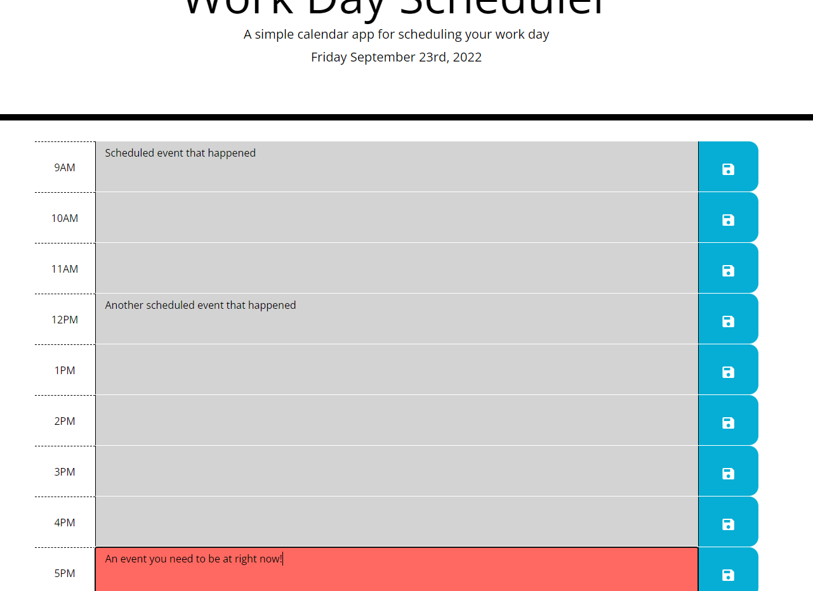

# Work Day Scheduler

## Description

This project is designed to be a simple, yet effectively tool in order to allow users to keep a daily agenda for their business hours, featuring live updated co-ordination
of colour of the timeslots, as well as functions to fully store the inputted information, all achieved through the use of third-party API's (creditted below). On top of
this, this project was an excellent exercise in how to achieve more with code, while typing less, as the code in the JavaScript is significantly more streamlined and
efficent compared to my earlier works.

## Installation

No installation required, repo runs entirely through the link below, or through opening the index.html in the default browser if accessing it locally from a download.

## Usage

By entering text into the larger, centre column, users will be able to input plans for times both in the past, present, and future, and upon click the large save icons
at the right of each column, save their inputs to be displayed again should they refresh or close and reopen the page, with the colours of the columns corresponding to times
that have happened, are currently happening, or will happen in the future.

Link: https://nathankryz.github.io/Work-Day-Scheduler/

## Credits

This repo was made with the aid of Bootstrap, Jquery, Google Fonts, and Google Icons.
